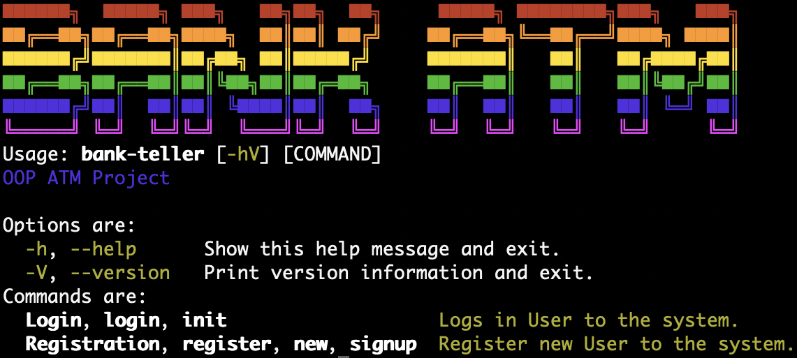
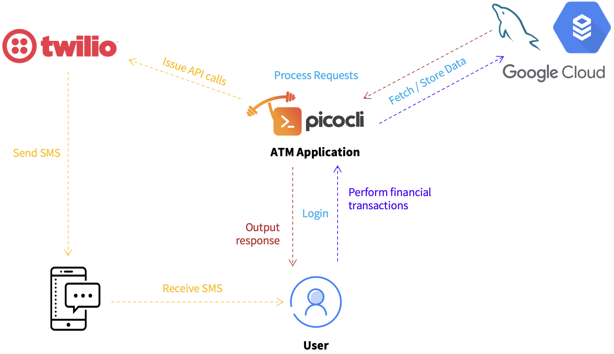
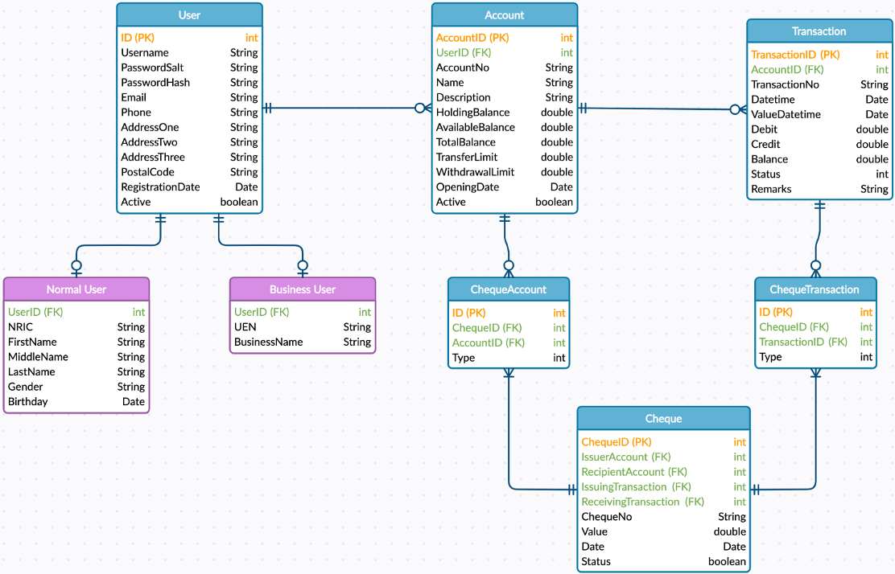
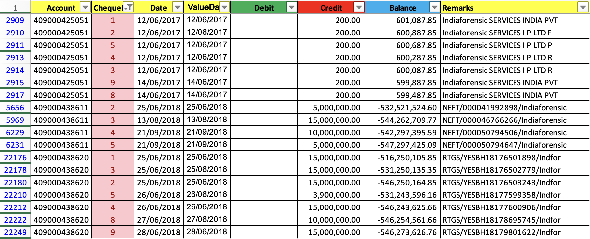
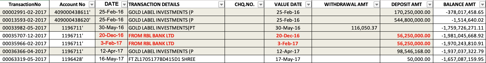

# 🏧 CSC1109 (Group 15) Automated Teller Machine Application
Command Line-based ATM application designed to facilitate digital financial transactions, without the need for any direct interactions with banking staff. A demo of our application is available [here](https://www.youtube.com/watch?v=ipexPsaOVC4).

## Team Members
- Peter Febrianto Afandy (2200959)
- Pang Zi Jian Adrian (2200692)
- Muhammad Nur Dinie Bin Aziz (2200936)
- Tng Jian Rong (2201014)
- Ryan Lai Wei Shao (2201159)

## List of Contents
- [System Design](#system-design)
- [Features](#features)
- [UML Design](#uml-design)
- [Project Components](#project-components)
- [Getting Started](#getting-started)
- [Program Usage](#program-usage)
- [Database Design](#database-design)
- [Financial Data](#financial-data)

## System Design
---
This application consists of two main components:
1. Database (GCP Cloud server)
2. ATM Application



<u>Database</u><br>
A MySQL database hosted on the cloud through the [Google Cloud Platform](https://cloud.google.com/sql) is used to store all user and financial transaction data for this application. Should the cloud server be unavailable, the application also supports the use of a local MySQL database, which requires additional configurations. For more information on the database design and how the financial data has been integrated, click [here](#database-design). 

<u>ATM Application</u><br>
The main ATM application is packaged into a single Java ARchive (JAR) file, which compiles all project dependencies and components, for ease of execution. Various libraries are used in the application, such as [picocli](https://picocli.info/) for the main command line interface, and [Twilio](https://www.twilio.com/docs/libraries/java), which enables 2-Factor Authentication through SMS messages.
## Features
---
### Fundamental Features
Various fundamental features have been implemented in this application to support its base operations. These include Create, Read, Update, Delete (CRUD) operations on the bank user, and their associated accounts. For deletion related operations, deletion will not effect in the actual deletion of data from the system. Like real-world banking applications, the data that is selected for deletion will be kept for record-keeping purposes. Deletion in this application would essentially only update the respective associated status (ie account status set to disabled).

<u>User Operations</u><br>
- User login
- User authentication
- New user registration
- User deactivation
- Reset of password
- Updating of user details

<u>Account Operations</u><br>
- Account creation
- Account deactivation
- Account information inquiry (account details, current balance)
- Cash withdrawal
- Cash deposit
- Fund transfer
    - Inter-account Transfer
    - Third-party Transfer
- Setting account transfer limit
- Setting account withdrawal limit
- View transactions
- View cheques received
### Advanced Features
<u>Database</u><br>
A MySQL database was designed to store the user, financial transaction and other ATM information. An in-depth explanation of the database design is provided in [this section](#database-design).


<u>Twilio API</u><br>
The Java API provided by [Twilio](https://www.twilio.com/docs/libraries/java) was used in this application in the implementation of user 2-Factor Authentication, through SMS text messages.

<u>Beautified Colored Command Line Interface</u><br>
To improve the user experience and make the application visually appealing for use, [picocli](https://picocli.info/) was implemented to provide a colorful user interface, delivered on the command line. 

<u>Password Hashing and Encryption</u><br>
To improve the cybersecurity aspects of this application, the SHA256 hashing algorithm was used to hash user passwords, together with a randomised given salt value. Additionally, AES256 encryption was utilised on top of the hashed password to further improve its confidentiality.

## UML Design
---
This application utilises the following UML architecture:

Upon completion of development, the overall UML architecture is:


## Project Components
---

```
README.md (this file)

credentials.md (file containing a list of user credentials)

CSC1109-ATM.jar (executable application)

ATM/ (contains application's source code)

database/ (contains database and dataset programs)

docs/ (contains documentation images)

presentation/ (contains presentation slides)

```

There are three main components/folders for this project:
1. JAR file
    - An executable platform-independent Java ARchive file is provided to ease the deployment and execution of this application.
2. ATM
    - Contains all the relevant program source code, and dependencies required.
3. Database
    - Contains programs used to process the given dataset, as well SQL files to set up the database.

## Getting Started
---
1. Download all required [files and folders](#project-components) for this project.
2. Ensure that you have `java` (minimally Java 17) installed on your machine. Click [here](https://www.java.com/en/download/help/download_options.html) for installation instructions if they are not already installed.

## Program Usage
---
### <u>Initial Project Setup</u>
This project utilises a Cloud MySQL database that have already been pre-configured for use. You can **skip this section** if you don't plan on setting up a local database again from scratch. <br>

Follow the instructions below to setup a local database for the application:
1. Ensure that you have installed MySQL on your machine. For installation instructions, click [here](https://dev.mysql.com/doc/mysql-installation-excerpt/5.7/en/).
2. On a terminal, run the following command to import the pre-configured database:
    ```
    mysql -u<username> -p < database/sql/DatabaseFullMockData_Setup30March2023.sql
    ```
3. Modify the `settings.config` configuration file in `ATM/` to connect to the local database instead of the cloud database. The following changes are required:
    ```
    DB_HOST=localhost
    DB_PORT=3306
    DB_NAME=OOP_ATM (Generally unchanged, unless your schema has a different name)
    DB_USER=username
    DB_PASSWORD=password
    ```
### Program Execution
1. Run the ATM application using the following command on a terminal:
    <br>**Ensure that you are in the same working directory as the program files (same directory as `ATM/`)*
    ```
    java -jar --enable-preview CSC1109-ATM.jar <option>
    
    Available options:
    Show all available options: -h, --help 
    Login to ATM: Login, login, init
    Register as a new user: register, new, signup, Registration

    ```
2. Start banking with us! You can use any user account provided in the [`credentials.md`](/credentials.MD) file to test the ATM application.


## Database Design
---
Due to the connected nature of financial data in the provided `bank.xlsx` dataset, a normalised relational database was designed to facilitate the storage and use of such data. The database is designed to be scalable, and to maintain minimal data replication. Each data table has an extra column which is used as its primary key within the database. The rationale for using an extra column for identifying each row of data is due to the use of custom formats for data such as `Account Number`, `Cheque Number` and `Transaction Number`.<br>

<br>

The database is designed to support different status for financial transactions to emulate real-life applications. For example, the `Transaction` table has a Status column that is used to indicate whether a transaction has been successfully executed, pending or failed/rejected. This status column is used in particular to mitigate fraudulent transactions, which is present in the dataset provided (more details are covered [here](#financial-data)). <br>

Additionally, the database also supports real-world usecases, such as pending transactions through the inclusion of various balances for a bank user's account. In this case, three separate balances are maintained for each account, `HoldingBalance`, which is used to indicate earmarked funds or pending incoming funds, `AvailableBalance`, which is used to indicate the actual balance available for use after deduction of the holding balance, and `TotalBalance`. These balances coupled with the status of financial transactions will enable the application to function and meet the needs of real-world usecases. <br>

Similarly, tables associated with cheques have varying statuses to indicate whether a cheque has been cleared, and to indicate the type of account and transaction involved (ie issuing account or receiving account, and issuing transaction or receiving transaction). <br>

However, for this application, these extra columns and data are not used directly, as there are ambiguities in terms of their usage, especially since this project is just in the form of a Proof-of-Concept. There are no easy way of verifying whether a cheque has been cleared, whether a transaction is fraudulent or not and whether a transaction has been released and deemed successful. In the real-world, there are separate systems built for these purposes alone, and varying factors are involved (ie company only charge pending transactions on a certain date). Hence, whilst the database have been specifically designed to support real-life applications, these design choices may not be directly used and implemented in this application.<br>

The database consists of <b>nine</b> tables, each consisting of the following data columns:
- User
    - `UserID` (database identifier)
    - Username
    - PasswordSalt
    - PasswordHash
    - Email
    - Phone
    - AddressOne
    - AddressTwo
    - AddressThree
    - Postal code
    - RegistrationDate
    - UserType
        - `1`: Normal User
        - `2`: Business User
    - Active
        - `1`: Active
        - `0`: Deactivated / Disabled
- NormalUser
    - UserID
    - NRIC
    - FirstName
    - MiddleName
    - LastName
    - Gender
    - Birthday
- BusinessUser
    - UserID
    - UEN
    - BusinessName
- Account
    - `AccountID` (database identifier)
    - AccountNo
    - Name
    - Description
    - HoldingBalance
    - AvailableBalance
    - TotalBalance
    - TransferLimit
    - WithdrawalLimit
    - OpeningDate
    - Active
        - `1`: Active
        - `0`: Deactivated / Disabled
- Transaction
    - `TransactionID` (database identifier)
    - AccountID
        - ID of account that the transaction is associated with
    - TransactionNo
    - Datetime
        - Transaction date (date at which a transaction is initiated/requested)
    - ValueDatetime
        - Value date refers to the effective date of a transaction (ie for cheques, it is the date that funds are released from the payer (to the bank) to the payee)
    - Debit
    - Credit
    - Balance
        - Account’s available balance after the transaction
    - Status
        - `-1`: Failed / Blocked
        - `0`: Pending
        - `1`: Successful
    - Remarks
- Cheque
    - `ChequeID` (database identifier)
    - ChequeNo
    - IssuerAccount
        - Account that issued the cheque
    - RecipientAccount
        - Account that will receive the funds released from the cheque
    - IssuingTransaction
        - Associated transaction for the outflow of money from issuer account
    - ReceivingTransaction
        - Associated transaction for the Inflow of money to recipient account
    - Value
    - Date
    - Status
        - Whether cheque has been successfully cleared (outflow from issuer, inflow to recipient accounts)
        - `-1`: Failed / Blocked
        - `0`: Pending
        - `1`: Successful
- ChequeTransaction
    - Mapping of Transactions with Cheques
    - ID
    - ChequeID
    - TransactionID
    - Type
        - 0: Issuing Transaction
        - 1: Receiving Transaction
- ChequeAccount
    - Mapping of Accounts with Cheques
    - ChequeID
    - AccountID
    - Type
        - 0: Issuing Account
        - 1: Receiving Account

## Financial Data
---
To facilitate and emulate its operations, the `bank.xlsx` dataset included in the project's specifications has been integrated into the application's database.  Due to the raw and unclear formatting of the dataset, a series of data pre-processing and transformations was applied to clean the data in order to integrate it into the database designed. Before cleaning and integrating the data, preliminary data analysis was performed to understand the data.  <br>

Additionally, to ease the use of the dataset, the following assumptions were taken:
- Transactions provided in the dataset are assumed to be correct and effected successfully (no concerns over negative balances)
    - To avoid ambiguity in edge cases (ie when an account has negative balance but is still able to withdraw money (could be a loan provided by the bank))
- Transactions are assumed to be executed in sequential order if they have the same date due to the absence of transaction time (ie transactions from the same date but further down are assumed to have been processed after earlier transactions from the same date higher up the file)
    - Workaround due to absence of `time` in Date column
- All accounts are assumed to be from the same bank branch (account number formatting)
    - Added branch code `409` to the front of the following account numbers (with zero-padding):
        - `1196711` → `409001196711`
        - `1196428` → `409001196428`
---
The following set of data cleaning was performed on each **column** of the `bank.xlsx` dataset provided:
- TransactionNo (New Column)
    - New column based on row index
    - Standardised format:
        `<8 digit no>` - `<transaction month>` - `<transaction year>`
        
        - 8 Digit Number
            - Incremental
            - Zero-padded
        - Transaction Month
            - `MM`
        - Transaction Year
            - `YYYY`
        - Transaction month and year are based on the `date` of transaction, which was previously named `valueDate`
        - Length: 16
            - Example: `12345678-02-2023`
- Account No (`Account`)
    - Renamed to `Account`
    - Remove trailing `'`
    - Standardised format `<branch code>` `<accountNo>`
        
        - Branch Code
            - First 3 digits of account number
        - Account No
            - Next 9 digits
            - Zero-padded
        - Length: 12
            - Example: `409001196711`
        - Added branch code `409` to the front of the following account numbers (with zero-padding):
            - `1196711` → `409001196711`
            - `1196428` → `409001196428`
- CHQ.NO. (`ChequeNo`)
    - Renamed to `ChequeNo`
    - Standardised format: `<6 digit no>` : `month & year` : `<accountNo>`
        - 6 digit no
            - Incremental
            - Zero-padded
        - Month & Year
            - `MMYYYY`
                - Based on `Date` (date cheque was effected)
        - Account No
        - Length: 26
            - Example: `873790:022023:409001196711`
        - By utilising the specified format, duplicate cheque numbers within the dataset are separated into unique values
            - Duplicate cheque numbers are related to three main accounts: `409000438620`, `409000438611`, `409000425051`
            - Cheques with duplicate cheque numbers are all issued from different accounts and individually unique (thus preventing any collisions or conflicts)
                     
- VALUE DATE (`Date`)
    - Renamed to `Date`
        - Transaction date (date at which a transaction is initiated/requested)
    - Format date
- DATE (`ValueDate`)
    - Renamed to `ValueDate`
        - Value date refers to the effective date of a transaction (ie for cheques, it is the date that funds are released from the payer (to the bank) to the payee)
        - Also known as Settlement Date
    - Format date
- DEPOSIT AMT (`Debit`)
    - Renamed to `Debit`
        - Debit refers to inflow of money into an account
- WITHDRAWAL AMT (`Credit`)
    - Renamed to `Credit`
        - Credit refers to outflow of money from an account
    - There are withdrawals for cents (eg. $0.01, $20.98), not possible for ATM
        - Might be bank transfers or some deductions, not through ATM (assumed to be correct)
- Status (New)
    - New column to check whether the transaction is successful or not
    - Values
        - `-1`: Failed / Blocked
        - `0`: Pending
        - `1`: Successful
- BALANCE AMT (`Balance`)
    - Renamed to `Balance`
    - Recalculate balances
        - Assumptions
            - Transactions are processed sequentially from the top-down. It is assumed that transactions with a lower index are effected earlier.
            - It is assumed that all transactions are approved by the bank and successful
                - To avoid ambiguity in edge cases such as when an account has negative balance but is still being able to withdraw money (could be a loan provided by the bank)
- TRANSACTION DETAILS (`Remarks`)
    - Renamed to `Remarks`
    - Convert values into general values (ie 6.13e+11)
- . (`Removed`)
Apart from these data processing on the dataset's columns, duplicate row entries were removed. Anomaly data were also dealt with separately, together with the following flagged transactions which were eventually deemed to be fraudulent transactions (status set to `-1`, rejected):

    - Record `63342` (TransactionNo: `00063319-05-2017`)
        - Value date is earlier than requested date
            - Date: 17/05/2017
            - Value Date: 16/05/2017
        - Resolved by **swapping both values**
            - Date: 16/05/2017
            - Value Date: 17/05/2017
    - Transaction that have been flagged out (highlighted cells and cells with red text)
        - Transactions are assumed to be flagged out as **potentially fraudulent transactions**
            - Deposits from RBL Bank Ltd
            - Deposits from and withdrawals to Gold Label Investments
                
        - Resolution: Transaction are not processed, status set to `0`